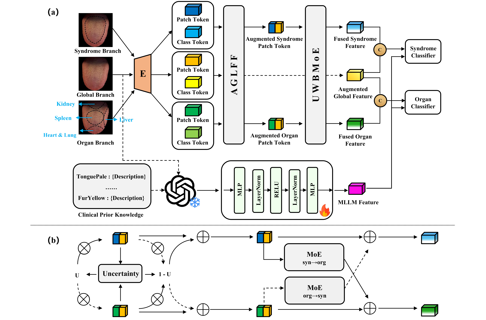

# MLLM-Enhanced Region-Aware Bidirectional Evidence-Based Model for Tongue Diagnosis

📌 **MLLM-Enhanced Region-Aware Bidirectional Evidence-Based Model for Tongue Diagnosis (CycleTCM)**

Tongue diagnosis, a convenient and noninvasive traditional diagnostic method in Traditional Chinese Medicine (TCM), provides an important tool for early health screening. Tongue images not only reveal TCM syndrome patterns but also allow a preliminary assessment of relevant organ health. However, most existing methods face three major limitations: (i) syndrome patterns and organ states prediction are often treated as independent tasks, ignoring their coupled mechanisms; (ii) tongue region-dependent signs are insufficiently integrated with global tongue appearance, resulting in inadequate attention to salient local cues; and (iii) clinical priors and TCM knowledge are underutilized, constraining clinically grounded reasoning and interpretability.

To address these limitations, we propose **CycleTCM**, an MLLM-Enhanced Region-Aware Bidirectional Evidence-Based Model for tongue diagnosis. Specifically, first, an **Augmented Global-Local Feature Fusion (AGLFF)** module is introduced to reconcile holistic tongue context with regional cues by mutually refining global and local representations, strengthening region-sensitive evidence extraction. Second, an **Uncertainty-Weighted Bidirectional Mixture-of-Experts (UWBMoE)** module is designed to propagate syndrome-level and organ-level information, thereby stabilizing multi-task learning and cross-level reasoning. Moreover, a multimodal large language model (MLLM) is incorporated to enrich semantic representations and improve alignment between visual evidence and clinically meaningful concepts. Experiments demonstrate that the proposed approach outperforms state-of-the-art baselines on both syndrome patterns and organ states prediction tasks.

<p align="center"></p>

## 📰News

**[NOTE]** The paper is accepted by **MICCAI 2026**.

## 💡Key Features

- A **region-aware multi-branch visual encoder** that jointly processes seven tongue views (whole, body, edge, and four organ-associated regions) for fine-grained evidence extraction.
- An **AGLFF module** that mutually refines global and local representations via cross-attention and gated fusion, strengthening region-sensitive sign detection.
- An **UWBMoE module** that performs bidirectional syndrome↔organ information propagation with uncertainty weighting, stabilizing coupled multi-task learning.
- **MLLM-enhanced multimodal fusion** using [Qwen3-VL-4B-Instruct](https://modelscope.cn/models/Qwen/Qwen3-VL-4B-Instruct) to align visual evidence with TCM clinical priors.
- Joint prediction of **8 syndrome attributes** and **5 organ states** with weighted BCE loss and comprehensive evaluation.

## 🛠Setup

**Tips A**: We test the framework using PyTorch ≥ 2.0 with CUDA support. A GPU with sufficient memory is recommended for MLLM feature extraction and multimodal training.

**Tips B**: Download the Qwen3-VL backbone before MLLM feature extraction.

## 📚Data Preparation

Place your tongue image dataset and labels under the `src/data` directory. The preprocessing pipeline consists of two steps:

**Step 1 — Region segmentation (body & edge).**

**Step 2 — Organ-associated region segmentation.**

**Step 3 — MLLM feature extraction (for multimodal training).**


## ⏳Training the Model

All training scripts should be executed from the `src` directory.

### Visual Model (AGLFF + UWBMoE)

Train the visual-only CycleTCM using seven regional tongue images:

```bash
cd src
python train/train_model_visual.py --output_log results_visual.log
```

### Multimodal Model (AGLFF + UWBMoE + MLLM)

Train the full CycleTCM with Qwen3-VL features fused at the representation level:

```bash
cd src
python train/train_model_multimodal.py --output_log results_multimodal.log
```

### MLLM-Only Baseline

Train a lightweight MLP classifier on Qwen3-VL features alone:

```bash
cd src
python train/train_model_mllm.py --output_log results_mllm.log
```

## 🎇Late Fusion Strategy

For late-fusion strategy of MLLM and visual model predictions, please refer to:

```bash
cd src
python utils/late_fusion.py \
    --llm-json [LLM_PREDICTIONS] \
    --tcm-json [TCM_PREDICTIONS] \
    --truth-json [GROUND_TRUTH]
```


